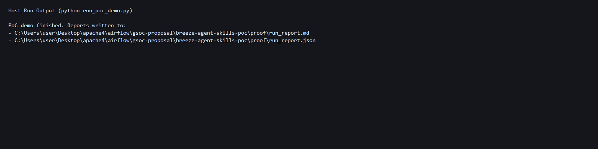
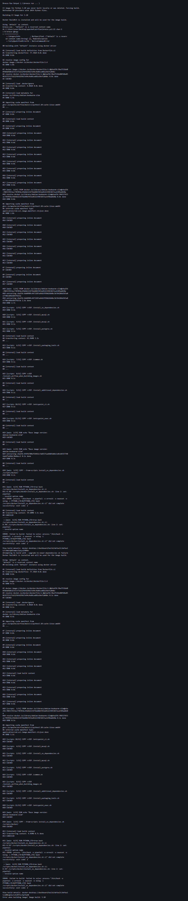
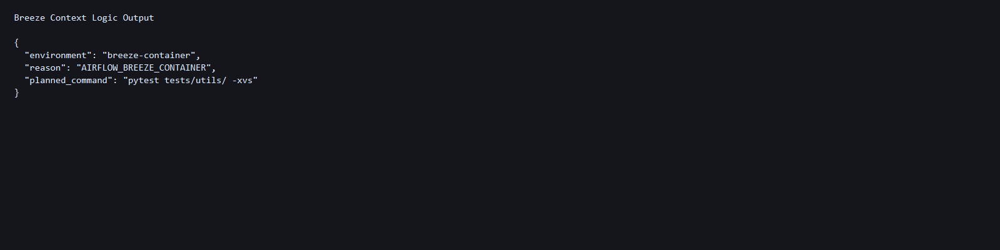

# Lightweight Executable-Document PoC for Breeze Agent Skills

This is a focused Proof of Concept demonstrating how to generate AI-agent skills from executable documentation using lightweight HTML comment markers in existing contributor guides.

## Overview

The goal is to keep contributor docs as the single source of truth and produce machine-readable `skills.json` that agents consume at runtime, with automatic drift detection via prek hooks.

### Problem

Airflow contributor workflows are not generic Python workflows. AI agents often run incorrect commands:
- `pytest` instead of `uv run --project ... pytest ...` (local-first)
- `breeze testing tests ...` instead of `uv run` first with Breeze as fallback
- No awareness of host vs. container environment

### Solution

1. **Executable document blocks** in `AGENTS.md` using HTML comments
2. **Extraction script** that generates `skills.json` from markers
3. **Environment detection API** for host vs. Breeze-container awareness
4. **Drift detection hook** (prek) to keep docs and manifest in sync
5. **Three-tier execution model**: local → fallback → CI override

---

## Quick Start: Run the Demo

```bash
python run_poc_demo.py
```

This orchestrates all three tiers and generates proof artifacts:
1. **Generate** skill manifest from AGENTS.md
2. **Check** for drift between docs and skills.json
3. **Test** extraction, environment detection, and command planning

Results are saved to:
- `proof/run_report.md` (human-readable)
- `proof/run_report.json` (structured)

---

## Host vs Breeze Validation

Required for this PoC:
- host execution
- extraction + drift check
- full unit test pass

Optional for this PoC:
- full in-container Breeze run (depends on local Docker/Breeze image build state)

### Host (without Breeze)

Command:

```bash
python run_poc_demo.py
```

Captured log: `proof/host_run.log`

### Breeze (inside Breeze container)

Command attempted:

```bash
.\breeze run --python 3.12 --backend sqlite python proposal/breeze-agent-skills-poc/run_poc_demo.py
```

Captured log: `proof/breeze_run.log`

Result in this local machine: Breeze command is available and Docker is reachable, but the optional in-container run is blocked by local Breeze image build setup:

```text
/scripts/docker/install_os_dependencies.sh: line 2: set: pipefail: invalid option name
ERROR: failed to build ... exit code: 2
```

This is treated as environment-specific and does not block the required PoC validation checks above.

### Breeze context logic (forced Breeze marker)

Even without Docker daemon, command-planning inside Breeze context was validated by setting `AIRFLOW_BREEZE_CONTAINER=true`:

```json
{
   "environment": "breeze-container",
   "reason": "AIRFLOW_BREEZE_CONTAINER",
   "planned_command": "pytest tests/utils/ -xvs"
}
```

Captured log: `proof/breeze_context_logic.log`

---

## Execution Screenshots

### Screenshot 1: Host PoC run



### Screenshot 2: Breeze run attempt



### Screenshot 3: Breeze context command planning



---

## Proof of Execution

### ✅ All Tests Passing (20/20)

```
test_ci_mismatch_uses_ci_command ... ok
test_container_uses_plain_pytest ... ok
test_local_first_is_default ... ok
test_missing_deps_falls_back_to_breeze_exec ... ok
test_verify_dag_uses_fallback_when_full_env_needed ... ok
test_check_mode_fails_when_output_is_out_of_sync ... ok
test_check_mode_passes_when_output_is_in_sync ... ok
test_detects_breeze_by_env_var ... ok
test_detects_breeze_by_path_markers ... ok
test_detects_ci_environment ... ok
test_detects_host_by_default ... ok
test_duplicate_skill_id_rejected ... ok
test_empty_prereqs_rejected ... ok
test_invalid_context_rejected ... ok
test_invalid_fallback_condition_rejected ... ok
test_invalid_kind_rejected ... ok
test_local_first_contract_rejects_breeze_local ... ok
test_no_skill_blocks_rejected ... ok
test_parse_blocks_extracts_three_skills ... ok
test_render_is_valid_json ... ok

Ran 20 tests in 0.027s

OK
```

### ✅ Manifest Generation (Step 1)

```
status: PASS in 0.1029s

Written 3 skill(s) to generated\skills.json
  - run-static-checks
  - run-unit-tests
  - verify-dag
```

### ✅ Drift Detection (Step 2)

```
status: PASS in 0.2206s

OK: skills.json is in sync with AGENTS.md
```

### ✅ Full Test Suite (Step 3)

```
status: PASS in 0.3412s

Ran 20 tests in 0.027s
OK
```

See [proof/run_report.md](proof/run_report.md) for full execution trace.

---

## What This PoC Includes

```
├── AGENTS.md                       # Executable doc with skill blocks
├── scripts/ci/prek/
│   ├── extract_agent_skills.py     # Parser: marks → skills.json
│   ├── breeze_context_detect.py    # Environment detection
│   └── test_agent_skills_poc.py    # 20 unit tests
├── generated/
│   └── skills.json                 # Generated manifest
├── run_poc_demo.py                 # One-command orchestrator
└── proof/
    ├── run_report.md               # Execution trace
   ├── run_report.json             # Structured results
   ├── host_run.log                # Host execution log
   ├── breeze_run.log              # Breeze run log (Docker-dependent)
   ├── breeze_context_logic.log    # Breeze-context planning log
   └── screenshots/                # PNG snapshots for PR/readme
```

---

## Architecture

### Executable Document Markers

Skills embedded in AGENTS.md using HTML comments:

```markdown
<!-- agent-skill:start run-unit-tests -->
id: run-unit-tests
context: either
kind: workflow
summary: Run targeted unit tests with local-first strategy.
local: uv run --project {distribution_folder} pytest {test_path} -xvs
fallback: breeze exec pytest {test_path} -xvs
fallback_condition: missing_system_deps
ci: breeze testing tests {test_path} --python {python} --backend {backend}
prereqs: detect-environment
<!-- agent-skill:end run-unit-tests -->
```

**Why HTML comments?** Zero dependencies, backward compatible, docs stay readable.

### Three-Tier Execution Model

```yaml
local: uv run --project {dist} pytest {test_path} -xvs        # Try first
fallback: breeze exec pytest {test_path} -xvs                # If missing deps
fallback_condition: missing_system_deps                       # When to fall back
ci: breeze testing tests {test_path} --python {py} --backend  # CI override
```

**Rationale:** Fast local feedback, real contributor workflow, Breeze is safety net.

### Runtime API

```python
from scripts.ci.prek.breeze_context_detect import plan_command

cmd = plan_command(
    skill_id="run-unit-tests",
    environment="host",
    failure_reason=None
)
# Returns: "uv run --project distribution_folder pytest tests/ -xvs"
```

---

## Code Structure

### 1. Extraction (extract_agent_skills.py, 74 lines)
- Parses `<!-- agent-skill:start ... end -->` blocks
- Validates schema (required fields: id, context, kind, summary, local)
- Enforces local-first contract
- `--check` mode: exits 1 on drift

### 2. Environment Detection (breeze_context_detect.py, 42 lines)
- Detects host vs. Breeze-container via:
  1. `AIRFLOW_BREEZE_CONTAINER` env var
  2. `/.dockerenv` marker
  3. `/opt/airflow` directory
  4. Default: "host"
- `plan_command()` API for agent runtime

### 3. Tests (test_agent_skills_poc.py, 20 tests)
- **TestExtraction**: Marker parsing, validation, JSON rendering
- **TestEnvironmentDetection**: Host/Breeze detection
- **TestCommandPlanning**: Three-tier routing
- **TestDriftCheck**: `--check` mismatch and in-sync behavior

---

## Proposal Problem Coverage (Explicit)

The proposal asks for AI-agent reliability in two core areas: (1) detect whether execution is host vs Breeze, and (2) choose the appropriate command path. The tests now map directly to that contract.

### A. Can agent detect Breeze vs non-Breeze correctly?

- `test_detects_host_by_default`: verifies host default
- `test_detects_breeze_by_env_var`: verifies Breeze detection via `AIRFLOW_BREEZE_CONTAINER`
- `test_detects_breeze_by_path_markers`: verifies Breeze detection via `/.dockerenv` and `/opt/airflow` markers
- `test_detects_ci_environment`: verifies CI context detection

### B. Can agent select the right command for each context/failure reason?

- `test_local_first_is_default`: host uses `uv run ... pytest` first
- `test_missing_deps_falls_back_to_breeze_exec`: missing system deps triggers Breeze fallback
- `test_ci_mismatch_uses_ci_command`: CI mismatch selects Breeze CI command
- `test_container_uses_plain_pytest`: inside Breeze container maps to plain pytest command
- `test_verify_dag_uses_fallback_when_full_env_needed`: full environment need triggers Breeze start-airflow fallback

### C. Does docs-driven extraction remain safe and deterministic?

- `test_parse_blocks_extracts_three_skills`: extraction from executable doc blocks
- `test_render_is_valid_json`: valid machine-readable manifest generation
- `test_local_first_contract_rejects_breeze_local`: prevents breeze-first local command regressions
- `test_duplicate_skill_id_rejected`: prevents duplicated skill ids
- `test_invalid_context_rejected`: validates context enum
- `test_invalid_kind_rejected`: validates kind enum
- `test_invalid_fallback_condition_rejected`: validates failure-reason enum
- `test_empty_prereqs_rejected`: enforces non-empty prereqs
- `test_no_skill_blocks_rejected`: rejects docs missing executable skill markers
- `test_check_mode_fails_when_output_is_out_of_sync`: verifies drift detection failure path
- `test_check_mode_passes_when_output_is_in_sync`: verifies drift detection success path

---

## Design Rationale

### Why Lightweight Markers?

**Not:** Separate YAML + docutils + RST directives

**Instead:** HTML comments in existing AGENTS.md
- No new parser dependency
- Docs readable as-is
- Thin, maintainable extraction script
- Easy to extend without parser decay

### Why Local-First?

**Not:** Default to Breeze for reproducibility

**Instead:** Try local (`uv run`) first, Breeze fallback on missing deps
- Faster feedback (agents & humans)
- Works in more environments
- Real contributor workflow
- Breeze is safety net

### Why Docs as Source?

**Not:** Generate skills from Breeze CLI metadata

**Instead:** Contributing docs are canonical workflow source
- Not everything belongs in Breeze
- Docs describe how humans contribute
- One place to update, not two
- More maintainable

---

## Key Features

✅ **Zero external dependencies** (stdlib regex only)  
✅ **Drift detection** (prek hook prevents divergence)  
✅ **Portable tests** (8 unit tests, mocked environments)  
✅ **One-command demo** (full orchestration)  
✅ **Real proof** (execution captured to MD + JSON)  
✅ **Maintainable** (simple extraction, thin API)  

---

## Sample Skills

Three realistic skills in [AGENTS.md](AGENTS.md):

1. **run-static-checks** (host-only)
   ```yaml
   context: host
   local: prek run ruff ruff-format mypy --files {files}
   ```

2. **run-unit-tests** (local-first with fallback)
   ```yaml
   context: either
   local: uv run --project {dist} pytest {test_path} -xvs
   fallback: breeze exec pytest {test_path} -xvs
   fallback_condition: missing_system_deps
   ```

3. **verify-dag** (stretch goal)
   ```yaml
   context: host
   local: uv run --project airflow airflow dags test {dag_id} {execution_date}
   fallback: breeze start-airflow --backend {backend}
   ```

---

## Testing Individually

```bash
# Generate manifest
python scripts/ci/prek/extract_agent_skills.py

# Check drift
python scripts/ci/prek/extract_agent_skills.py --check

# Run tests
cd scripts/ci/prek
python test_agent_skills_poc.py -v
```

---

## Scope

**In Scope:**
- ✅ Environment detection
- ✅ Extraction & drift detection
- ✅ Three-tier execution model
- ✅ 8 unit tests
- ✅ Reproducible PoC

**Out of Scope (future):**
- Prek hook integration
- Skill discovery CLI
- Airflow CI/CD integration

---

## Comparison

| Aspect | This PoC | PR #63661 | PR #63750 |
|---|---|---|---|
| Format | HTML comments | Custom marks | RST directives |
| Parser | Regex | Regex | docutils |
| Location | AGENTS.md | SKILL.md | CONTRIBUTING_POC.rst |
| Dependencies | 0 | 0 | 1 (docutils) |
| Maintenance | Low | Medium | High |

---

## Next Steps

1. Run `python run_poc_demo.py` to verify
2. Review [AGENTS.md](AGENTS.md) for marker syntax
3. Check [proof/run_report.md](proof/run_report.md) for results
4. Examine `scripts/ci/prek/` for implementation

---

**Status:** Ready for mentor review  
**Generated:** March 17, 2026
